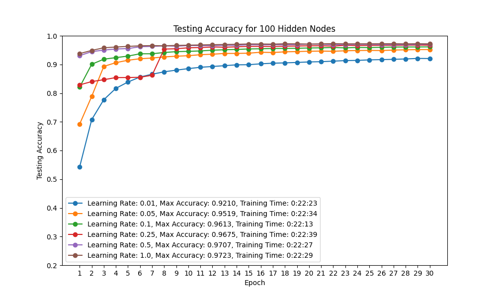
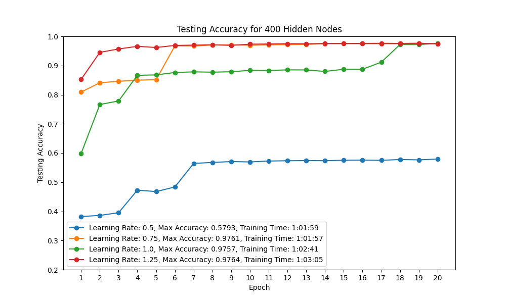
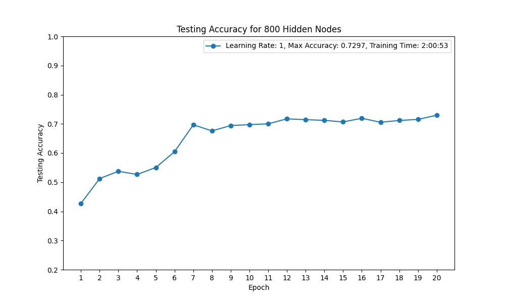

# NeuralNetworkMNIST

## About this project

In the era of powerful machine learning libraries like TensorFlow and PyTorch, it might seem unnecessary to build a neural network from scratch. However, doing so can provide valuable insights. It allows us to understand the underlying mechanisms that drive the learning process in a neural network. This project is an attempt to build a neural network using just Python and NumPy, applied to the MNIST Handwritten Digits Dataset.

## Why Build a Neural Network from Scratch?

Building a neural network from scratch gives us a deeper understanding of the inner workings of neural networks. It helps us appreciate the complexity behind these powerful tools and can provide insights that are useful when designing and debugging neural networks in the future.

## Results

The neural network achieved a maximum accuracy of 97.69% on the testing set.

The progress of the network's learning can be visualized through the accuracy plots generated during the training process. These plots show the testing accuracy of the network over different epochs.


This graph shows the testing accuracy for a specific configuration of the network. The x-axis represents the epochs, and the y-axis represents the testing accuracy. 


## Key Components of the Network

The `network.py` file contains the implementation of the neural network. Here are some key parts:

### Loading The MNIST Data

I have included a copy of the MNIST handwritten digit dataset in the 'data' folder. Once unzipped, it includes a training set and a testing set in a csv format. To extract the data and parse the csv file we can do the following:

```python
data = [] # initialize data array
file = open('data/mnist_train.csv', 'r') # open file object
file.readline() # skip the first line
for d in file:
    d = d[:-1]
    split = d.split(",")
    data.append([int(split[0]), np.asarray(split[1:], float)/255])
```

### Building the network

It is common to see a neural network visualized an a graph like structure with nodes and edges. However, actually implementing a neural network this way is not efficient at all. Instead, we can store an array of the weights and biases. If we know the structure of the neural net, we can use this information to reconstruct the model at any time. The following code initializes arrays for the weights and biases to random values. The weights are truncated between -1 and 1

```python
    # initialize the weights and biases
    weights = []
    biases = []
    for i in range(1, len(nodes_per_layer)):
        weights.append(np.random.rand(nodes_per_layer[i], nodes_per_layer[i-1])*2 - 1)
    for i in range(1, len(nodes_per_layer)):
        biases.append(np.random.randn(nodes_per_layer[i]))

```

### Forward Propagation

In forward propagation, we calculate the output of the network for a given input. This involves passing the input through each layer, applying the weights and biases, and then the activation function. Here's how we implement this in the code:

```python
# forward propogation function
def forward_propagation(input, nodesPerLayer, weights, biases):

    # initialize empty set of nodes
    output = []
    for nodeCount in nodesPerLayer:
        output.append(np.zeros(nodeCount, float))
    
    # set first layer to input
    output[0] = input

    # set the value of each node based on the preivous layer's values, the weights and the biases.
    for layerIndex in range(1, len(nodesPerLayer)):
        for nodeIndex in range(0, len(weights[layerIndex - 1])):
            output[layerIndex][nodeIndex] = sigmoid(np.sum(np.multiply(output[layerIndex - 1], weights[layerIndex - 1][nodeIndex])) + biases[layerIndex-1][nodeIndex])
    return output
```

### Backward Propagation

Backward propagation is used to update the weights and biases of the network. It calculates the gradient of the loss function with respect to the network's parameters (weights and biases). Here's the implementation:

```python
# backward propagation function
def backward_propagation(output, expected_result, nodesPerLayer, weights, biases):

    # initialize empty set of errors
    errors = []
    for nodeCount in nodesPerLayer:
        errors.append(np.zeros(nodeCount, float))
    
    # calculate the error for the output layer
    errors[-1] =  sigmoid_derivative(np.dot(weights[-1], output[-2]) + biases[-1]) * sum_squared_difference_derivative(output[-1], expected_result)
    
    # calculate errors
    for layerIndex in range(len(nodesPerLayer) - 2, 0, -1):
        errors[layerIndex] = sigmoid_derivative(np.dot(weights[layerIndex - 1], output[layerIndex - 1]) + biases[layerIndex - 1]) * np.dot(errors[layerIndex + 1], weights[layerIndex])
    
    # calculate the gradient of the weights and biases
    gradient_weights = []
    gradient_biases = []
    for layerIndex in range(len(nodesPerLayer) - 1):
        gradient_weights.append(np.outer(errors[layerIndex + 1], output[layerIndex]))
        gradient_biases.append(errors[layerIndex + 1])
```

### Training The Network

The training process involves repeatedly applying forward and backward propagation across multiple epochs. In each epoch, the network's parameters are adjusted to minimize the error between the actual output and the expected output.

```python
# run the neural network with the given parameters and return the accuracies
def run_neural_network(nodes_per_layer, learning_rate, epochs):
    # [initialization of weights, biases, and data not shown for brevity]
    # loop for epochs
    for e in tqdm(range(epochs), desc="Training progress"):
        # [training logic not shown for brevity]
        # testing code
        correct = 0
        for d in testing_data:
            output = forward_propagation(d[1], nodes_per_layer, weights, biases)
            index_max = np.argmax(output[len(nodes_per_layer)-1])
            if (d[0] == index_max):
                correct += 1
        testing_accuracy.append(correct / len(testing_data))
    return [testing_accuracy, time_taken]
```

### Testing The Network

The final section of the neural network script focuses on evaluating the performance of the network under different configurations. This involves testing various combinations of learning rates and node configurations, and then outputting the results to CSV files for analysis.

Here are some example testing parameters:

```python
learning_rates = [0.01, 0.1, 0.25, 0.5, 0.75, 1.0]

nodes_per_layer_configs = [
    [28*28, 10, 10],
    [28*28, 50, 10],
    [28*28, 100, 10],
    [28*28, 200, 10],
    [28*28, 400, 10],
    [28*28, 800, 10],
    [28*28, 100, 50, 10],
    [28*28, 200, 100, 10],
    [28*28, 300, 100, 50, 10]
]

epochs = 20
```

**Note that the script running as defined here would talk many hours to run. This configuration is more useful when experimenting with smaller models**

We then loop over each configuration and store the results in a csv file:

```python
for nodes_per_layer in nodes_per_layer_configs:
    hidden_layer_sizes = '_'.join(map(str, nodes_per_layer[1:-1]))
    
    with open(f'test_results_{hidden_layer_sizes}.csv', 'w', newline='') as file:
        writer = csv.writer(file)
        writer.writerow(rows)

        for learning_rate in learning_rates:
            testing_accuracy, training_time = run_neural_network(nodes_per_layer, learning_rate, epochs)
            writer.writerow([learning_rate] + testing_accuracy + [training_time])

```

### Creating Graphs with matplotlib

The `graph.py` script allows you to create visual representations of the neural network's performance using the data stored in CSV files. It generates plots showing the testing accuracy for each learning rate over the epochs, which helps in analyzing the effectiveness of different configurations.

The script uses pandas, matplotlib, and argparse libraries to read the CSV files, process the data, and plot the results. The best test case was shown at the beginning of this document, but here are some more examples:






## Conclusion

This project showcases the process of building a neural network from scratch using Python and NumPy. By implementing the core concepts of neural networks (forward propagation, backward propagation), we gain a deeper understanding of these powerful machine learning models. The project also demonstrates the application of this neural network on the MNIST Handwritten Digits Dataset, achieving a respectable accuracy. The generated graphs provide a visual representation of the network's learning process, further enhancing our understanding of how neural networks learn from data.

## Running the Code

To run the code, follow these steps:

1. Ensure you have Python and NumPy installed on your system, I used Python 3.11
2. Once you clone the repo, make sure you unzip the dataset in the data folder
3. 
4.
5. Run the `network.py` script using `python network.py`.

Please note that you may need to adjust the parameters within the `network.py` script to suit your specific needs, such as the number of nodes per layer, the learning rate, and the number of epochs.